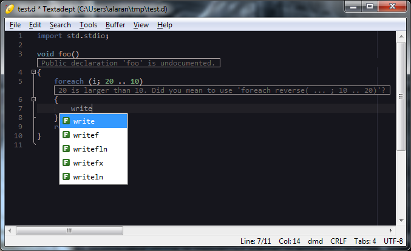

textadept-d
===========
D language plugin for Textadept



## Features
* Code autocomplete and DDOC display (DCD)
* Go-to-declaration (DCD)
* Inline code linting and syntax checking (D-Scanner)
* Symbol index with go-to-declaration(D-Scanner)
* Snippets
* Supports Textredux and normal Textadept dialogs
* Tested on Linux and Windows. (It should work on BSD and OS-X, but this is not tested)

## Requirements
* Textadept 7.8 or later or Textadept nightly build dated 2015-01-06 or later
* DCD
* D-Scanner

## Installation
* Download textadept-d and place the "dmd" folder in "~/.textadept/modules/" ("$HOME\.textadept\modules" on Windows)
* Download and build [DCD](https://github.com/Hackerpilot/DCD/)
* Download and build [D-Scanner](https://github.com/Hackerpilot/Dscanner/)
* Place the dcd-client binary on your $PATH, or edit the line in dmd/init.lua that says ```M.PATH_TO_DCD_SERVER = "dcd-client"```
* Place the dcd-server binary on your $PATH, or edit the line in dmd/init.lua that says ```M.PATH_TO_DCD_CLIENT = "dcd-client"```
* Place the dscanner binary on your $PATH, or edit the line in dmd/init.lua that says ```M.PATH_TO_DSCANNER = "dscanner"```

## Key Bindings
Key|Action
---|------
*Ctrl+{*|Open brace and automatically indent next line
*Ctrl+Enter*|Autocomplete
*Ctrl+Shift+G*|Go to declaration of symbol at cursor
*Ctrl+Shift+M*|Display symbol index for current file
*Ctrl+;*|Go to end of line, insert semicolon
*Shift+Enter*|Go to end of line, insert semicolon, insert newline
*Enter*|Newline with automatic multi-line comment continuation
*Ctrl+Shift+H*|Show ddoc for symbol at cursor
